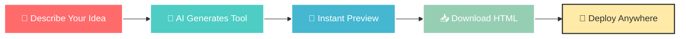

<div align="center">

# 🐐 NoCodeGoat
### *Accessible Tool Generator*


*Transform your ideas into accessible web applications with the power of AI*

[](https://accessible-tool-generator.streamlit.app/)
[](https://python.org)
[](https://streamlit.io)
[](https://www.w3.org/WAI/WCAG21/quickref/)

---

</div>

## 🌟 What is NoCodeGoat?

**NoCodeGoat** is an revolutionary AI-powered platform that bridges the gap between imagination and implementation. Simply describe what you need in plain English, and watch as sophisticated, fully accessible web applications come to life instantly.

> *"Making digital accessibility effortless for everyone, one tool at a time."*

---

## ✨ Key Features

<table>
<tr>
<td width="50%">

### 🤖 **AI-Powered Magic**
Transform natural language into functional web apps using cutting-edge AI technology

### ♿ **Accessibility First**
Every tool meets WCAG 2.1 AA standards out of the box

### ⚡ **Instant Results**
Watch your ideas come to life in real-time with live preview

</td>
<td width="50%">

### 📱 **One-Click Deploy**
Download standalone HTML files ready for immediate deployment

### 📚 **Smart History**
Persistent tool management with quick access to your creations

### 🎯 **Full-Screen Experience**
Professional tool interface for real-world usage

</td>
</tr>
</table>

---

## 🛡️ Accessibility Standards

<div align="center">

| Feature | Status | Description |
|---------|--------|-------------|
| **Semantic HTML** | ✅ | Proper HTML5 structure for screen readers |
| **ARIA Support** | ✅ | Complete labels, roles, and properties |
| **Keyboard Navigation** | ✅ | Full functionality without mouse |
| **Screen Reader Ready** | ✅ | Optimized for assistive technologies |
| **High Contrast** | ✅ | 4.5:1+ color contrast ratio |
| **Touch Targets** | ✅ | Minimum 44px interactive elements |
| **Focus Management** | ✅ | Clear visual focus indicators |
| **Responsive Design** | ✅ | Works on all devices and screen sizes |

</div>

---

## 🎬 See It In Action

<div align="center">

[](https://www.youtube.com/watch?v=1-9Oqxgyz8k)

*Click above to see NoCodeGoat in action!*

</div>

### 🎯 Real Examples You Can Generate

<details>
<summary><strong>🛒 Voice-Controlled Shopping List</strong></summary>

```
"I need a voice-controlled shopping list that works with screen readers"
```
**Generated Features:**
- 🎤 Speech recognition for hands-free input
- 🔊 Audio feedback for confirmations
- ♿ Full screen reader compatibility
- ⌨️ Complete keyboard shortcuts
- 📱 Mobile-optimized interface

</details>

<details>
<summary><strong>🧮 Accessible Calculator</strong></summary>

```
"A large-button calculator for people with motor difficulties"
```
**Generated Features:**
- 🔘 44px+ touch-friendly buttons
- 🎨 High contrast color scheme
- ⌨️ Full keyboard navigation
- 🎯 Clear focus indicators
- 📐 Logical button layout

</details>

<details>
<summary><strong>⏰ Multi-Alert Timer</strong></summary>

```
"A simple timer with visual and audio alerts"
```
**Generated Features:**
- 🔔 Multiple notification types
- 🌈 High contrast display
- ♿ Accessible time controls
- 🎵 Customizable alert sounds
- 📱 Responsive design

</details>

---

## 🚀 Quick Start Guide

### 📋 Prerequisites

<div align="center">


</div>

### 💻 Installation

```bash
# 1️⃣ Clone the magic
git clone https://github.com/yourusername/accessible-tool-generator.git
cd accessible-tool-generator

# 2️⃣ Create your environment
python -m venv venv

# 3️⃣ Activate it
# Windows
venv\Scripts\activate
# macOS/Linux  
source venv/bin/activate

# 4️⃣ Install dependencies
pip install -r requirements.txt
```

### 🔑 API Configuration

1. **Get your Gemini API key** from [Google AI Studio](https://makersuite.google.com/app/apikey)
2. **Create `.env` file** in project root:

```env
GEMINI_API_KEY=your_actual_api_key_here
```

### 🎉 Launch NoCodeGoat

```bash
streamlit run app.py
```

Open your browser to `http://localhost:8501` and start creating! 🎊

---

## 💡 How to Use

<div align="center">

### The Magic Process



</div>

### 📝 Step-by-Step

1. **🎯 Describe**: Tell NoCodeGoat what you want in plain English
2. **⚡ Generate**: Click the magic button and watch AI work
3. **👀 Preview**: See your tool working instantly in the browser
4. **💾 Save**: Download standalone HTML or use the live interface
5. **🔄 Iterate**: Access your tool history and make improvements

---

## 🏆 Why Choose NoCodeGoat?

<div align="center">

| 🌟 **Traditional Development** | 🐐 **NoCodeGoat** |
|------|------|
| Weeks of coding | Minutes of describing |
| Accessibility afterthought | Accessibility built-in |
| Complex deployment | One-click download |
| Technical expertise required | Natural language input |
| Manual testing needed | AI-generated perfection |

</div>

---

## 🤝 Contributing

We welcome contributions! NoCodeGoat thrives on community input and innovative ideas.

<div align="center">

[](https://github.com/yourusername/accessible-tool-generator/issues)
[](https://github.com/yourusername/accessible-tool-generator/pulls)

</div>

---

## 📄 License

This project is licensed under the MIT License - see the [LICENSE](LICENSE) file for details.

---

*NoCodeGoat - Where ideas become accessible reality*

</div>
